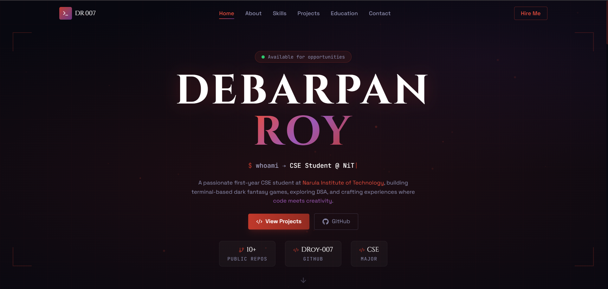

# 🚀 MyPortfolio

A modern and responsive personal portfolio website built to showcase projects, skills, achievements, and passion for technology. Designed with smooth animations, clean UI, and a developer-focused aesthetic.

---

## 🌟 Features

- ⚡ Modern responsive UI
- 🎨 Smooth animations using Framer Motion
- 🧑‍💻 Dynamic typewriter effect
- 📱 Fully mobile-friendly design
- 🌙 Dark themed aesthetic
- 🚀 Fast and optimized performance
- 🔗 Social media integration
- 📂 Project showcase section
- 📜 Skills & tech stack display
- 📬 Contact section

---

## 🛠️ Tech Stack

### Frontend
- ⚛️ React
- 🟦 TypeScript
- 🎨 Tailwind CSS
- 🎞️ Framer Motion

### Icons & UI
- Lucide React

### Development Tools
- Vite
- VS Code
- Git & GitHub

---

## 📸 Preview



---

## 📂 Project Structure

```bash
MyPortfolio/
│
├── src/
│   ├── assets/
│   ├── components/
│   ├── data/
│   ├── pages/
│   ├── styles/
│   └── App.tsx
│
├── ATTRIBUTIONS.md
├── index.html
├── package-lock.json
├── package.json
├── tsconfig.json
├── vite.config.ts
└── README.md
```

---

## ⚙️ Installation & Setup

Clone the repository:

```bash
git clone https://github.com/DRoy-007/MyPortfolio.git
```

Move into the project directory:

```bash
cd MyPortfolio
```

Install dependencies:

```bash
npm install
```

Run the development server:

```bash
npm run dev
```

---

## 🚀 Deployment

This project can be deployed easily on:

- ▲ Vercel
- Netlify
- GitHub Pages

---

## 🧠 Inspiration

This portfolio reflects creativity, coding passion, and continuous learning in:

- Web Development
- C Programming
- DSA
- UI/UX Design
- Open Source

---

## 📬 Contact

### 👤 Debarpan Roy
- 🎓 B.Tech CSE Student
- 💻 Tech Enthusiast & Developer

#### 🌐 Connect With Me
- Portfolio: Add deployed website link here
- GitHub: https://github.com/DRoy-007
- LinkedIn: https://linkedin.com/in/debarpan-roy
- Instagram: https://instagram.com/droy_007.in
- X (Formerly Twitter): https://x.com/DebarpanRoy07

---

## ⭐ Support

If this project helped or inspired you, consider giving it a ⭐ on GitHub.

---


---

> “Code. Create. Learn. Repeat.” 🔥
